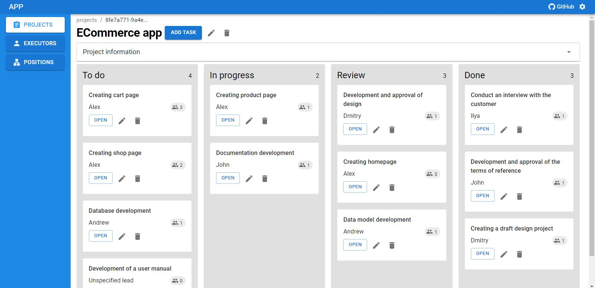

### Progect management system - web-app for project management

Demo: https://ivanzemsky.github.io/ProjectManagement/

The main goal of this project is to create a simple client web application using the feature-sliced-design architecture.

The application is single-user and does not have a database, all data is stored in the browser's local storage.

<picture>
 
</picture>

### Technology stack:
+ React 18 (TypeScript)
+ Material UI
+ Mobx
+ react-hook-form
+ dnd kit

### Installation (npm)
1. Clone the repository:
```git clone https://github.com/IvanZemsky/ProjectManagement.git [folder]```
2. Install packages:
```npm install ```
3. Run the project:
```npm run dev```